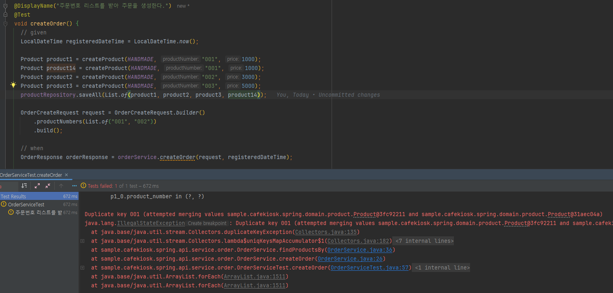

### @NoArgsConstructor(access = AccessLevel.PROTECTED)

### @Table(name = "orders")
- order는 sql에서 예약어기 때문에 설정을 해주지 않으면 오류가 발생한다.

### @OneToMany(mappedBy = "order", cascade = CascadeType.ALL)
order가 생성,삭제,변경이 되면 같이 작업이 일어나도록 CascadeType.ALL 설정
- order가 save 될 때를 확인해보자.
  ```java
      @OneToMany(mappedBy = "order", cascade = CascadeType.ALL)
      private List<OrderProduct> orderProducts = new ArrayList<>();
   ```
   ```java
     Order savedOrder = orderRepository.save(order);
   ```
  - 실행 결과 쿼리 중 일부: order가 저장될 때 관련 order_product도 같이 저장된 것을 볼 수 있다.
    ```sql
      Hibernate:
      insert
      into
      orders
      (created_date_time, modified_date_time, order_status, registered_date_time, total_price, id)
      values
      (?, ?, ?, ?, ?, default)
      Hibernate:
      insert
      into
      order_product
      (created_date_time, modified_date_time, order_id, product_id, id)
      values
      (?, ?, ?, ?, default)
      Hibernate:
      insert
      into
      order_product
      (created_date_time, modified_date_time, order_id, product_id, id)
      values
      (?, ?, ?, ?, default)
      Hibernate:
      insert
      into
      order_product 
      ...
    ```
### findAll{컬럼}In(List<>) List에 중복값 주의
여기서는 주문할 때 ProductNumber로 상품을 찾았다.

주문을 같은 상품을 2개이상 한다면 `findAllByProductNumberIn`에서 반환되는 상품리스트는 상품의 중복은 없을 것이다.

그래서 아래에서는 중복이 없는 결과를 Map 자료형으로 만들어주고 Map을 이용해 기존의 dto 변환작업을 해준다. 
```java
  private List<Product> findProductsBy(List<String> productNumbers) {
    List<Product> products = productRepository.findAllByProductNumberIn(productNumbers);
    Map<String, Product> productMap = products.stream()
        .collect(Collectors.toMap(Product::getProductNumber, p -> p));

    return productNumbers.stream()
        .map(productMap::get)
        .collect(Collectors.toList());
  }
```
> 주의
> 
> 여기서 `products.stream().collect(Collectors.toMap(Product::getProductNumber, p -> p));`는
> 
> `products`에 key(productNumber)가 중복이 된다면 오류가 발생할 것이다.
> 
> - 예시
>   
> 
