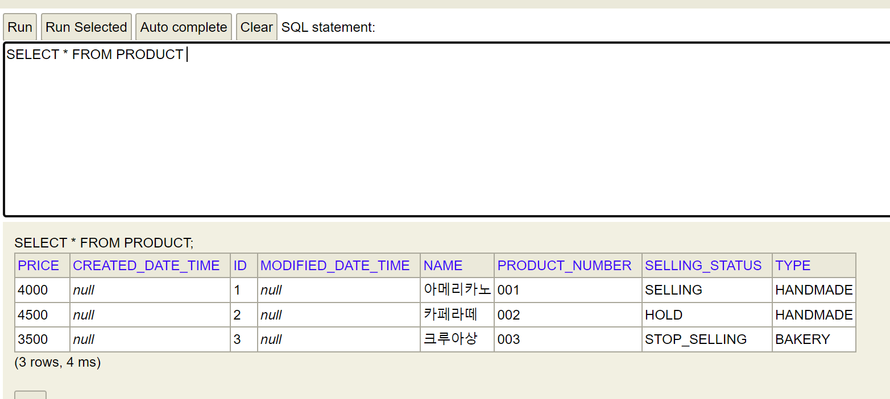

## spring.profiles.default
```properties
  spring.profiles.default=local
```
- 프로파일을 지정하지 않으면 항상 Local Profile로 하위에 있는 Local Profile로 뜬다.
  - 실행 결과 console
    
> "test" profile로 지정하고 싶다면 어노테이션을 사용하면 된다
> ```java
>   @ActiveProfiles("test")
>  ```
> ```yaml
>   spring.config.activate.on-profile=test # 테스트용 프로파일
>   
>   spring.jpa.hibernate.ddl-auto=create
>   spring.jpa.show-sql=true
>   spring.jpa.properties.hibernate.format_sql=true
>   
>   spring.sql.init.mode=never
>   
>  ```
## spring.jap.defer-datasource-initialization
```properties
spring.jap.defer-datasource-initialization=true
```
- spring 2.5 부터 있는 설정
- 값이 `true`가 아니면 Hibernate 초기화 이전에 data.sql이 실행된다. ➡️ 에러 발생!
  
  >  ❓ **WHy?**
  > 
  >  JPA를 사용하기 때문에 Hibernate가 초기화되면서 DDL 테이블 정보가 생기는데 `true`면 생기기 이전에 에러가 나게된다.
  
  >  ✅ **언제 사용하는가?**
  >  - 보통 초기 개발할 때만 데이터를 미리 넣어놓을 때 사용한다.
  >  - 테스트할 때는 테스트 상에서 기본 데이터를 만든다.
  >    ```properties
  >     spring.sql.init.mode=never
  >    ```
- 실행결과
  ```sql
  Hibernate: 
    drop table if exists product cascade 
  Hibernate:
    create table product (
    price integer not null,
    created_date_time timestamp(6),
    id bigint generated by default as identity,
    modified_date_time timestamp(6),
    name varchar(255),
    product_number varchar(255),
    selling_status enum ('HOLD','SELLING','STOP_SELLING'),
    type enum ('BAKERY','BOTTLE','HANDMADE'),
    primary key (id)
  )

  ```
  
   > 참고: created_date_time, updated_date_time은 jpa를 통해서 입력할 때만 작동된다. 
      