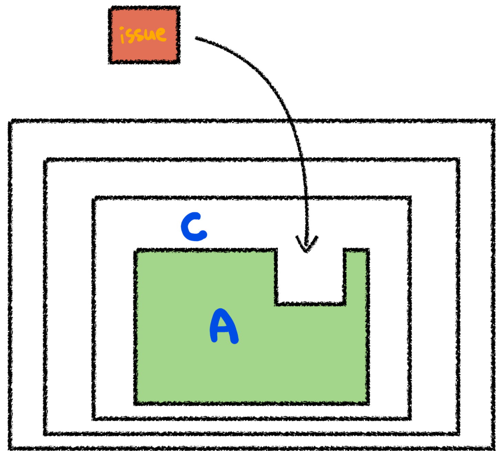

# 테스트 케이스 세분화하기
요구사항이 있을 때 내가 구현하려고 하는 것이 요구사항과 정확히 일치하는지 확인해야한다.

- 해피케이스: 요구사항을 만족하는 테스트
- 예외케이스: 예외가 존재하는 케이스
  - ex: 양수가 필요한 값에 음수가 들어왔을 경우
- 경계값테스트: 범위(이상, 이하, 초과, 미만, 기간등)의 경계값 조건이 있을 때 경계값에 대한 테스트

# 테스트 어려운 영역 분리
먼저 예시를 살펴보자.
## 시간 범위 제한조건이 있는 경우
### 문제가 될 수 있는 코드
아래와 같이 함수를 정의하면 테스트할 때 어떤 문제가 있을까?
```java
public Order createOrder() {
          LocalDateTime currentDateTime = LocalDateTime.now();
          LocalTime currentTime = currentDateTime.toLocalTime();
  if (currentTime.isBefore(SHOP_OPEN_TIME) || currentTime.isAfter(SHOP_CLOSE_TIME)) {
      throw new IllegalArgumentException("주문 시간이 아닙니다. 관리자에게 문의하세요.");
    }

  return new Order(currentDateTime, beverages);
}
```
위의 함수를 단위 테스트 해보면 아래와 같이 작성할 수 있다.
```java
@Test
  @DisplayName("가게 운영시간에만 성공하는 주문 생성 테스트")
  void createOrder() {
    CafeKiosk cafeKiosk = new CafeKiosk();
    Americano americano = new Americano();
    cafeKiosk.add(americano);

    Order order = cafeKiosk.createOrder();

    assertThat(order.getBeverages()).hasSize(1);
    assertThat(order.getBeverages().get(0).getName()).isEqualTo("아메리카노");
  }
```
> **문제점 살펴보기**
> 
> 해당 테스트는 항상 성공하는 테스트 일까?
> 
> 아니다. 테스트를 하는 시각이 언제냐에 따라 테스트의 결과는 달라질 것이다.

### 해결하기
항상 성공하는 테스트를 작성하기 위해 코드를 바꿔보자.
```java
public Order createOrder(LocalDateTime currentDateTime) {
    LocalTime currentTime = currentDateTime.toLocalTime();
    if (currentTime.isBefore(SHOP_OPEN_TIME) || currentTime.isAfter(SHOP_CLOSE_TIME)) {
      throw new IllegalArgumentException("주문 시간이 아닙니다. 관리자에게 문의하세요.");
    }

    return new Order(currentDateTime, beverages);
  }
```
위와 같이 currentDateTime을 외부에서 정하도록 하는 것이다.

currentDateTime을 외부에서 지정하게 함으로써 아래와 같이 항상 성공하는 테스트를 작성할 수 있다.
```java
@Test
  @DisplayName("주문 생성 테스트 - currentTime을 외부로 뺀 케이스 - 경계값 10시")
  void createOrderWithCurrentTime() {
    CafeKiosk cafeKiosk = new CafeKiosk();
    Americano americano = new Americano();
    cafeKiosk.add(americano);

    Order order = cafeKiosk.createOrder(LocalDateTime.of(2023, 1, 17, 10, 0));

    assertThat(order.getBeverages()).hasSize(1);
    assertThat(order.getBeverages().get(0).getName()).isEqualTo("아메리카노");
  }

  @Test
  @DisplayName("주문 생성 예외 테스트 - currentTime을 외부로 뺀 케이스 - 경계값 9시")
  void createOrderOutsideOpenTime() {
    CafeKiosk cafeKiosk = new CafeKiosk();
    Americano americano = new Americano();
    cafeKiosk.add(americano);

    assertThatThrownBy(() -> cafeKiosk.createOrder(LocalDateTime.of(2023, 1, 17, 9, 59)))
        .isInstanceOf(IllegalArgumentException.class)
        .hasMessage("주문 시간이 아닙니다. 관리자에게 문의하세요.");
  }
```
> 이처럼 구현 내용을 바꾸어 해결할 수 있다.

## 테스트가 어려운 영역보는 시야 기르기
테스트 가능한 A코드에 위의 예시처럼 테스트 불가능한 B의 코드가 추가가 된다면
A전체는 테스트 불가능한 상태가 될 것이다.


이런 경우 문제가 되는 영역(위의 예시에서는 currentDateTime)을 외부로 분리하도록 해야한다.

위의 코드에서 초점은 현재 시각이 중요한 것이 아닌, 어떤 시각이 주어졌을 때 가능한 시각인지를 판단하는 것이 중요하다.

### 어느 단계까지 분리를 해주어야 할까?
위의 A 코드를 사용하는 C코드가 있다고 생각하자.

C 코드도 테스트가 가능하게 하려면 문제가 되었던 영역을 외부로 또 분리해야할 것이다.



외부로 분리할 수록 테스트 가능한 코드는 많아질 것이다.

그러면 무조건 가장 상단으로 올리는 것이 좋을까?
적당한 멈추는 선이 있을 것이다.

## 테스트 어려운 영역 정의해보기

- 관측할 때마다 다른 값에 의존하는 코드(INPUT)
  - 외부 세계에 존재하는 값을 사용하기 때문에 외부 세계에서 들어오는 값이라고 볼 수 있다.
  - 현재 날짜/시간, 랜덤 값, 전역 변수/함수, 사용자 입력 등
- 외부 세계에 영향을 주는 코드(OUTPUT)
  - 우리의 함수가 외부에 영향을 주는 경우 
  - 표준 출력, 메시지 발송, 데이터베이스에 기록하기 등

## 순수 함수(pure function): 테스트 쉬운 코드
- 같은 입력에는 항상 같은 결과
- 외부 세상과 단절된 형태
- 테스트하기 쉬운 코드

> **정리**
> 
> - 해피 케이스와 예외 케이스를 둘 다 고려할 것
> - 경계값 테스트를 고려할 것
> - 테스트하기 쉬운/어려운 영역을 구분하자(순수함수)