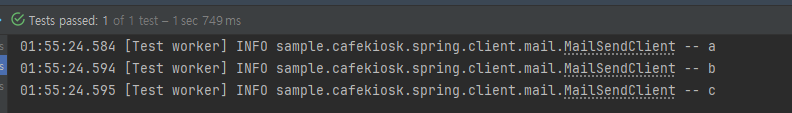

# 순수 Mockito로 검증해보기
`@Mock`, `@Spy`, `@InjectMocks`
@MockBean은 결국 Bean이라 스프링 컨텍스트가 작동해야 효과가 있는 것이다.

실제 빈을 Mockito의 mock 객체로 갈아끼운다는 것이다.

항상 스프링을 띄울 때만 Mockito를 사용하지는 않을 것이다.

그래서 이번에는 MockBean이 아닌 순수 Mockito로만 진행해볼 것이다.

```java
@RequiredArgsConstructor
@Service
public class MailService {

  private final MailSendClient mailSendClient;
  private final MailSendHistoryRepository mailSendHistoryRepository;

  public boolean sendMail(String fromEmail, String toEmail, String subject, String content) {
    boolean result = mailSendClient.sendEmail(fromEmail, toEmail, subject, content);
    if (result) {
      mailSendHistoryRepository.save(MailSendHistory.builder()
          .fromEmail(fromEmail)
          .toEmail(toEmail)
          .subject(subject)
          .content(content)
          .build()
      );
      return true;
    }

    return false;
  }

}
```

위의 코드는 스프링을 사용한다면 bean 두개를 사용할 것이지만 순수 Mockito 작성을 위해 직접 mock 객체를 만들어 줘보자.

## Mock 객체 만들기
### mock 메서드 이용
```java
public static <T> T mock(Class<T> classToMock) {
  return mock(classToMock, withSettings());
}

public static MockSettings withSettings() {
  return new MockSettingsImpl().defaultAnswer(RETURNS_DEFAULTS);
  
  // public static final Answer<Object> RETURNS_DEFAULTS = Answers.RETURNS_DEFAULTS; 
  // withSetting: 별다른 값을 지정해주지 않아도 자동 기본값을 던져줌(RETURNS_DEFAULTS)
}
```
```java
MailSendClient mockMailSendClient = Mockito.mock(MailSendClient.class);
MailSendHistoryRepository mockMailSendHistoryRepository = mock(MailSendHistoryRepository.class);
```
### 어노테이션 사용해서 간편하게 mock 만들기
```java
@ExtendWith(MockitoExtension.class) 
class MailServiceTest {

  @Spy
  private MailSendClient mailSendClient;

  @Mock
  private MailSendHistoryRepository mailSendHistoryRepository;

  @InjectMocks
  private MailService mailService;
```
- @ExtendWith(MockitoExtension.class)를 적용하면 test가 실행될때 mock만들 것 이라고 인지해준다.
- @InjectMocks 이라는 곳의 생성자를 보고 mock 객체로 선언된 애들을 mock 객체로 선언된 애들을 inject 해준다.(DI와 같은 개념)
## Mockito.verify
조금 더 명확하게 보고 싶을 때, verify에 먹 객체와 times(1) 같이 몇번 호출되었는지, 타임아웃 등 검증 가능.
```java
public static <T> T verify(T mock, VerificationMode mode) {
  return MOCKITO_CORE.verify(mock, mode);
}
```
```java
Mockito.verify(mockMailSendHistoryRepository, times(1)).save(any(MailSendHistory.class));
// mockMailSendHistoryRepository의 save(MailSendHistory)가 한번 불렸는지
```

## @Spy
몇 번 호출됐는지 등의 행위에 대한 기록을 하는 객체

verify와 비슷하다.
> verify - 몇번 호출? 타임아웃? 시간안에 몇번 호출?

### @Mock과 @Spy의 차이 알아보기
만약 MailSendService에서 사용하는 MailSendClient에 기능이 많고 service에서 다 호출한다면?
```java
@RequiredArgsConstructor
@Service
public class MailService {

  private final MailSendClient mailSendClient;
  private final MailSendHistoryRepository mailSendHistoryRepository;

  public boolean sendMail(String fromEmail, String toEmail, String subject, String content) {
    boolean result = mailSendClient.sendEmail(fromEmail, toEmail, subject, content);
    if (result) {
      mailSendHistoryRepository.save(MailSendHistory.builder()
          .fromEmail(fromEmail)
          .toEmail(toEmail)
          .subject(subject)
          .content(content)
          .build()
      );
      mailSendClient.a();
      mailSendClient.b();
      mailSendClient.c();
      return true;
    }

    return false;
  }

}
```
```java
@Slf4j
@Component
public class MailSendClient {

  public boolean sendEmail(String fromEmail, String toEmail, String subject, String content) {
    log.info("메일 전송");
    throw new IllegalArgumentException("메일 전송");
  }
  public void a() {
    log.info("a");
  }

  public void b() {
    log.info("b");
  }

  public void c() {
    log.info("c");
  }
}
```
위의 상황에서 MailSenClient에 메일 보내는 로직만 stubbing을 하고, 기능 abc는 원본 객체에 동일하게 동작 했으면 좋겠다고 생각해보자.

이럴 때 사용하는 것이 spy다.

# 테스트 코드

```java
@DisplayName("메일 전송 테스트")
@Test
void sendMail1() {
// given
MailSendClient mockMailSendClient = Mockito.mock(MailSendClient.class);
MailSendHistoryRepository mockMailSendHistoryRepository = mock(MailSendHistoryRepository.class);

MailService mailService = new MailService(mockMailSendClient, mockMailSendHistoryRepository);

when(mockMailSendClient.sendEmail(anyString(), anyString(), anyString(), anyString()))
    .thenReturn(true);
// when
boolean result = mailService.sendMail("", "", "", "");

// then
assertThat(result).isTrue();
Mockito.verify(mockMailSendHistoryRepository, times(1)).save(any(MailSendHistory.class));
}
```

- spy를 사용할 땐 when을 사용하면 안된다. ➡️  doReturn 사용하면 된다.
```java
@ExtendWith(MockitoExtension.class) // Mockito 사용할 것이라고 알림 
class MailServiceTest {

  @Spy
  private MailSendClient mailSendClient;

  @Mock
  private MailSendHistoryRepository mailSendHistoryRepository;

  @InjectMocks
  private MailService mailService;

  @DisplayName("메일 전송 테스트")
  @Test
  void sendMail() {

    // given
    // spy는 when 사용 못함
//        when(mailSendClient.sendEmail(anyString(), anyString(), anyString(), anyString()))
//            .thenReturn(true);
    //실제 객체를 활용하기 때문에 이런 문법으로 작성한다.
    doReturn(true)
        .when(mailSendClient)
        .sendEmail(anyString(), anyString(), anyString(), anyString());

    // when
    boolean result = mailService.sendMail("", "", "", "");

    // then
    assertThat(result).isTrue();
    verify(mailSendHistoryRepository, times(1)).save(any(MailSendHistory.class));
  }
```
위에서
```java
doReturn(true)
        .when(mailSendClient)
        .sendEmail(anyString(), anyString(), anyString(), anyString()); // sendEmail만 스터빙이 됨
```
작성하면 doReturn으로 stubbing 해준 sendEmail만 stubbing이 되고 mailSendClient 원본 객체대로 행동하여 여기서는 로그가 찍히는 것을 볼 수 있다.



> 한 객체 안에서 일부는 stubbing 일부는 실제 원본 객체 사용하고 싶을 때 spy를 사용하면 된다.

> spy 쓰는 빈도는 높지 않다고 한다.
> 하나의 객체 기능이 엄청 많은데 얘를 일부만 쓰고 일부만 mocking 하는일은 별로 없다.

## BDDMockito
이름만 바꿨다!  