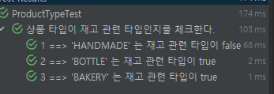

# @ParameterizedTest
- [Junit5 Parameterized Tests](https://junit.org/junit5/docs/current/user-guide/#writing-tests-parameterized-tests)
- [Spock Data Tables - groovy 언어 사용](https://spockframework.org/spock/docs/2.3/data_driven_testing.html#data-tables)
단순 하나의 테스트 케이스인데 값을 여러개로 바꿔보면서 테스트 하고싶을 때가 있다.

이럴 때 사용하면 좋은 것이 Parameterized 테스트다.

아래의 테스트에 @ParameterizedTest 를 적용해보자.
```java
  @DisplayName("상품 타입이 재고 관련 타입인지를 체크한다.")
  @Test
  void containsStockType3() {
    // given
    ProductType givenType1 = ProductType.HANDMADE;
    ProductType givenType2 = ProductType.BOTTLE;
    ProductType givenType3 = ProductType.BAKERY;

    // when
    boolean result1 = ProductType.containsStockType(givenType1);
    boolean result2 = ProductType.containsStockType(givenType2);
    boolean result3 = ProductType.containsStockType(givenType3);

    // then
    assertThat(result1).isFalse();
    assertThat(result2).isTrue();
    assertThat(result3).isTrue();
  }
```

## @CsvSource("값들")
```java
  @DisplayName("상품 타입이 재고 관련 타입인지를 체크한다.")
  @CsvSource({"HANDMADE,false","BOTTLE,true","BAKERY,true"})
  @ParameterizedTest
  void containsStockType4(ProductType givenType, boolean expected) {
    // when
    boolean result = ProductType.containsStockType(givenType);

    // then
    assertThat(result).isEqualTo(expected);
  }
```
## @MethodSource("메서드명")
```java
  @DisplayName("상품 타입이 재고 관련 타입인지를 체크한다.")
  @MethodSource("provideProductTypesForCheckingStockType")
  @ParameterizedTest
  void containsStockType_ParameterizedTest2(ProductType givenType, boolean expected) {
    // when
    boolean result = ProductType.containsStockType(givenType);

    // then
    assertThat(result).isEqualTo(expected);
  }
```

## Customizing Display Names
```java
@DisplayName("Display name of container")
@ParameterizedTest(name = "{index} ==> the rank of ''{0}'' is {1}")
@CsvSource({ "apple, 1", "banana, 2", "'lemon, lime', 3" })
void testWithCustomDisplayNames(String fruit, int rank) {
}
```
```java
Display name of container ✔
├─ 1 ==> the rank of 'apple' is 1 ✔
├─ 2 ==> the rank of 'banana' is 2 ✔
└─ 3 ==> the rank of 'lemon, lime' is 3 ✔
```