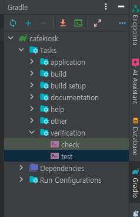
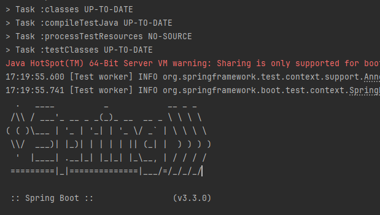

# 테스트 환경 통합하기
테스트가 수행되는 시간도 비용이다.


서버가 뜨는 횟수가 많아진다면 테스트 수행시간이 많이 길어지게 된다.
어떻게 하면 더 빠른 시간 내에 효과적인 테스트를 수행할 수 있을지 고민해야 한다.

테스트를 수행하면 

- OrderControllerTest
  ```java
    @WebMvcTest(controllers = OrderController.class)
    class OrderControllerTest {}
  ```
- ProductControllerTest
  ```java
    @WebMvcTest(controllers = ProductController.class)
    class ProductControllerTest {}
  ```
- OrderServiceTest
  ```java
   @ActiveProfiles("test")
   @SpringBootTest
   class OrderServiceTest {}
  ```
- OrderStatisticsServiceTest
  ```java
  @SpringBootTest
  @ActiveProfiles("test")
  class OrderStatisticsServiceTest {}
  ```
- OrderRepositoryTest
  ```java
  @ActiveProfiles("test")
  @DataJpaTest
  class OrderRepositoryTest {}
  ```
- StockRepositoryTest
  ```java
  @DataJpaTest
  class StockRepositoryTest {}
  ```

총 6개의 테스트에서 스프링부트서버가 통합테스에서 뜬다.

spring boot 테스트여도 띄우는 환경이 조금이라도 차이가 나면 별도로 뜨게 된다.

그래서 이런 것들을 맞춰서 동일한 환경에서 테스트들이 모두 수행이 될 수 있도록 공통적인 환경들은 좀 모아주면 
서버가 뜨는 시간을 줄일 수 있다.

## 상위 클래스 만들어 추출하기

### @SpringBootTest - IntegrationTestSupport
```java
package sample.cafekiosk.spring;

import org.springframework.boot.test.context.SpringBootTest;
import org.springframework.boot.test.mock.mockito.MockBean;
import org.springframework.test.context.ActiveProfiles;
import sample.cafekiosk.spring.client.mail.MailSendClient;

@ActiveProfiles("test")
@SpringBootTest
public abstract class IntegrationTestSupport {

  @MockBean
  protected MailSendClient mailSendClient;

}
```
- OrderServiceTest
  ```java
  class OrderServiceTest extends IntegrationTestSupport {}
  ```
- OrderStatisticsServiceTest
  ```java
  class OrderStatisticsServiceTest extends IntegrationTestSupport {}
  ```
    - `@MockBean`은 서버가 새로 떠야 된다.
      - bean을 Mock 객체로 교체하겠다는 의미이기 때문에 다른 환경으로 인식한다.
- ProductServiceTest
  ```java
  class ProductServiceTest extends IntegrationTestSupport {}
  ```
- ProductRepositoryTest
  ```java
  @Transactional
  class ProductRepositoryTest extends IntegrationTestSupport {}
  ```
- StockRepositoryTest
  ```java
  @Transactional
  class StockRepositoryTest extends IntegrationTestSupport {}
  ```
`repository`의 `@DataJpaTest`도 서버가 새로 뜨기때문에 통합해주었다.

### @WebMvcTest - ControllerTestSupport
컨트롤러는 MockMvc를 사용한 `@WebMvcTest`를 사용해서 통합하기 어렵다.

서비스 mocking을 하여 컨트롤러 레이어만 BeanVaildation 을 사용해서 검증하기 때문에 성격이 다르다.

인테그레이션 테스트와 다르게 구축이 필요하다.
```java
package sample.cafekiosk.spring;

import com.fasterxml.jackson.databind.ObjectMapper;
import org.springframework.beans.factory.annotation.Autowired;
import org.springframework.boot.test.autoconfigure.web.servlet.WebMvcTest;
import org.springframework.boot.test.mock.mockito.MockBean;
import org.springframework.test.web.servlet.MockMvc;
import sample.cafekiosk.spring.api.controller.order.OrderController;
import sample.cafekiosk.spring.api.controller.product.ProductController;
import sample.cafekiosk.spring.api.service.order.OrderService;
import sample.cafekiosk.spring.api.service.product.ProductService;

@WebMvcTest(controllers = {
    OrderController.class,
    ProductController.class
})
public abstract class ControllerTestSupport {

  @Autowired
  protected MockMvc mockMvc;

  @Autowired
  protected ObjectMapper objectMapper;

  @MockBean
  protected OrderService orderService;

  @MockBean
  protected ProductService productService;

}
```
- ProductControllerTest
  ```java
  class ProductControllerTest extends ControllerTestSupport {}
  ```
- OrderControllerTest
  ```java
  class OrderControllerTest extends ControllerTestSupport {}
  ```