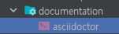
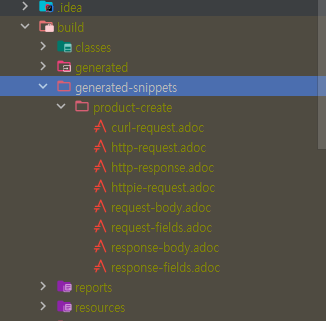
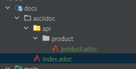
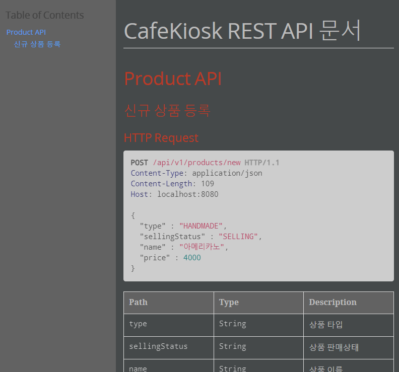
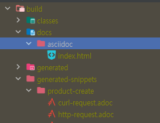
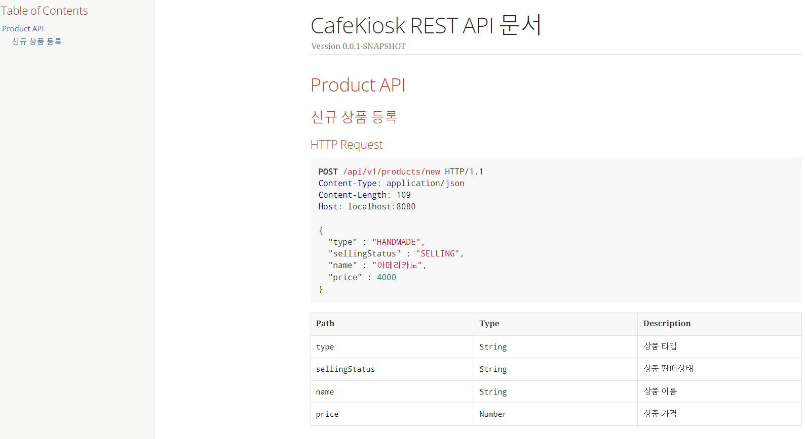
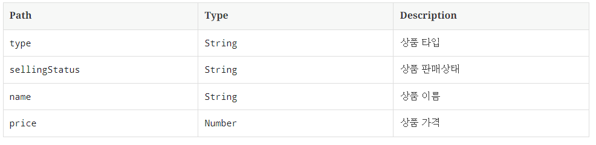
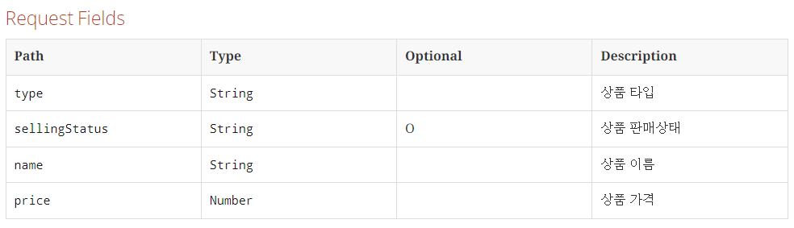
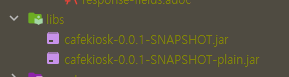

# Spring REST Docs
[spring REST Docs](https://docs.spring.io/spring-restdocs/docs/current/reference/htmlsingle/)
[swagger](https://swagger.io/)
[asciidoctor](https://asciidoctor.org/)
내가 만든 API를 문서로 만들 수 있다.

API를 설계할 때 엔드 포인트들이 있을 것이다. 
각 엔드 포인트들의 스펙을 정의하고 개발을 진행하는데 이럴 때 유용하게 사용할 수 있는 것이 API 문서다.

> API 문서를 만들 수 있는 도구들 중 하나가 Spring REST Docs다.

## Spring REST Docs 의 특징
- 테스트 코드를 통한 API 문서를 자동화해서 만들 수 있다.
  - 테스트 코드를 작성해 빌드를 누르면 문서가 만들어 진다.
- API 명세를 문서로 만들고 외부에 제공함으로써 협업을 원할하게 한다.
- 기본적으로 AsciiDoc을 사용하여 문서를 작성한다.
> AsciiDoc: 마크다운 같은 문서 작성 문법

## REST Docs vs Swagger
### REST Docs 
- 장점
  - 테스트를 통과해야 문서가 만들어진다.(신뢰도가 높다.)
  - 프로덕션 코드에 비침투적이다.
- 단점
  - 코드 양이 많다.
  - 설정이 어렵다.
### Swagger
- 장점
  - 적용이 쉽다.
  - 문서에서 바로 API 호출 수행이 가능하다.
- 단점
  - 프로덕션 코드에 침투적이다.
    - 어노테이션을 컨트롤러에 달아서 문서를 작성하게 되어 프로덕션 코드가 지저분해질 수 있다.
  - 테스트와 무관하기 때문에 신뢰도가 떨어질 수 있다.

> api 호출을 바로바로 수행하고 싶다면 swagger, 
> 
> 신뢰성, 프로덕션 코드 변경하지 않고 문서를 작성하고 싶다면 REST Docs

## AsciiDoctor
> Asciidoc 문서를 html으로 변환해준다.

## dependency
```groovy
plugins {
  id "org.asciidoctor.jvm.convert" version "3.3.2"
}
configurations {
  asciidoctorExt
}
dependencies {
  // RestDocs
  asciidoctorExt 'org.springframework.restdocs:spring-restdocs-asciidoctor'
  testImplementation 'org.springframework.restdocs:spring-restdocs-mockmvc'
}

ext { // 전역 변수
  snippetsDir = file('build/generated-snippets')
}

test {
  outputs.dir snippetsDir
}

asciidoctor {
  inputs.dir snippetsDir
  configurations 'asciidoctorExt'

  sources { // 특정 파일만 html로 만든다.
    include("**/index.adoc")
  }
  baseDirFollowsSourceFile() // 다른 adoc 파일을 include 할 때 경로를 baseDir로 맞춘다.
  dependsOn test
}

bootJar {
  dependsOn asciidoctor
  from("${asciidoctor.outputDir}") {
    into 'static/docs'
  }
}
```
- 플러그인 추가
  ```groovy
  plugins {
  id "org.asciidoctor.jvm.convert" version "3.3.2"
  }
  ```
- 확장 플러그 configurations에 대한 의존성을 넣음
  ```groovy
  configurations {
    asciidoctorExt
  }
  `asciidoctorExt 'org.springframework.restdocs:spring-restdocs-asciidoctor'`
  ```
- `testImplementation 'org.springframework.restdocs:spring-restdocs-mockmvc'`
  - restdocs를 사용할 대 MockMvc를 많이 사용
- 익스텐션 전역변수 선언
  ```groovy
  ext { // 전역 변수
  snippetsDir = file('build/generated-snippets')
  }
  ```
  - snippet에 대한 디렉토리를 정의
    > - snippets 
    >  - 코드의 조각들을 정의할 것이다.
    >  - 문서의 조각조각을 snippet 이라고 부른다.
  - spring을 개발하고 build를 하면 jar 파일이 생기는데 이 jar파일 안에 문서를 담을건데 
    이 과정을 gradle 테스크로 정의를 하게 될 것이서 보통 경로를 build 하위에 지정한다고 한다.
- 테스트가 끝난 결과물을 snippet 디렉토리로 지정
  ```groovy
  test {
    outputs.dir snippetsDir
  }
  ```
  - 레스트 독스를 만들기 위한 테스트 작성을 하는데 그 테스트에 대한 결과물로 나온 파일들을 snippetDir에 넣는다.
- asciidoctor
  ```groovy
  asciidoctor {
    inputs.dir snippetsDir
    configurations 'asciidoctorExt'
  
    sources { // 특정 파일만 html로 만든다.
      include("**/index.adoc")
    }
    baseDirFollowsSourceFile() // 다른 adoc 파일을 include 할 때 경로를 baseDir로 맞춘다.
    dependsOn test
  }
  ```
  - `dependsOn test`
    - 작업의 순서
    - 여기선 테스트가 수행된 다음 아스키 독터가 수행된다는 것이다.(=의존성이 있다는 의미)
  - `configurations 'asciidoctorExt'`
    - 적용한 확장 플러그인을 여기에 설정
- bootJar
  ```groovy
  bootJar {
  dependsOn asciidoctor
  from("${asciidoctor.outputDir}") {
  into 'static/docs'
  }
  }
  ```
  - jar를 만드는 과정
  - `dependsOn asciidoctor`
    - `asciidoctor`에 의존성이 있다.
      - test -> asciidoctor -> bootJar 로 실행될 것이다.
  - asciidoctor 를 실행하면 문서가 나오는데 
    해당 문서를 정적 파일로 보기위해 해당 소스 코드 내에 static docs 하위에 복사를 하는 과정을 거친다.

## Asciidoc 플러그인

asciidoc 문법에 대한 미리보기가 가능하다.

# 테스트 코드 작성하기
## REST Docs에 대한 설정을 할 수 있는 상위 클래스
```java
package sample.cafekiosk.spring.docs;

import com.fasterxml.jackson.databind.ObjectMapper;
import org.junit.jupiter.api.BeforeEach;
import org.junit.jupiter.api.extension.ExtendWith;
import org.springframework.restdocs.RestDocumentationContextProvider;
import org.springframework.restdocs.RestDocumentationExtension;
import org.springframework.test.web.servlet.MockMvc;
import org.springframework.test.web.servlet.setup.MockMvcBuilders;

import static org.springframework.restdocs.mockmvc.MockMvcRestDocumentation.documentationConfiguration;

@ExtendWith(RestDocumentationExtension.class) // RestDoc에 대한 확장을 주입
public abstract class RestDocsSupport {

  protected MockMvc mockMvc;
  protected ObjectMapper objectMapper = new ObjectMapper();

  /**
   * REST Doc 작성을 위한 MockMvc setup
   * @param provider
   */
  @BeforeEach
  void setUp(RestDocumentationContextProvider provider) {
    this.mockMvc = MockMvcBuilders.standaloneSetup(initController())
        .apply(documentationConfiguration(provider))
        .build();
  }

  protected abstract Object initController();

}
```

- REST Doc 작성을 위한 MockMvc setup
  ```java
  @BeforeEach
  void setUp(RestDocumentationContextProvider provider) {
  this.mockMvc = MockMvcBuilders.standaloneSetup(initController())
  .apply(documentationConfiguration(provider))
  .build();
  }
  ```
  - 이전의 통합 테스트 에서는 스프링이 자동 MockMvc를 주입해준 것과 달리 여기선 직접 만들어 준다.

### MockMvcBuilders로 만드는 두 가지 방법
1. webAppContextSetup
  ```java
  @BeforeEach
   void setUp(WebApplicationContext webApplicationContext,
   RestDocumentationContextProvider provider) {
   this.mockMvc = MockMvcBuilders.webAppContextSetup(webApplicationContext)
   .apply(documentationConfiguration(provider))
   .build();
  }
  ```
  - 여기서 `webApplicationContext`는 스프링의 컨텍스트 이다.
    - SpringBootTest로 RESTDoc을 작성해야하는 것이다. (`@SpringBootTest`)
      - 이러면 문서를 작성할 때도 스프링 서버를 띄워야 한다.
2. standaloneSetup
  ```java
  @BeforeEach
  void setUp(RestDocumentationContextProvider provider) {
  this.mockMvc = MockMvcBuilders.standaloneSetup(initController())
  .apply(documentationConfiguration(provider))
  .build();
  }
  ```
  - provider만 있으면 된다.
  - 파라미터로는 컨트롤러를 주입하면 된다.
    - 여기서는 추상 클래스임으로 하위 클래스에서 컨트롤러 주입을 할 수 있도록 추상 메서드를 이용한다.

## ProductControllerDocsTest
```java
import org.junit.jupiter.api.DisplayName;
import org.junit.jupiter.api.Test;
import org.springframework.http.MediaType;
import org.springframework.restdocs.payload.JsonFieldType;
import sample.cafekiosk.spring.api.controller.product.ProductController;
import sample.cafekiosk.spring.api.controller.product.dto.request.ProductCreateRequest;
import sample.cafekiosk.spring.api.service.product.ProductService;
import sample.cafekiosk.spring.api.service.product.request.ProductCreateServiceRequest;
import sample.cafekiosk.spring.api.service.product.response.ProductResponse;
import sample.cafekiosk.spring.docs.RestDocsSupport;
import sample.cafekiosk.spring.domain.product.type.ProductSellingStatus;
import sample.cafekiosk.spring.domain.product.type.ProductType;

import static org.mockito.ArgumentMatchers.any;
import static org.mockito.BDDMockito.given;
import static org.mockito.Mockito.mock;
import static org.springframework.restdocs.mockmvc.MockMvcRestDocumentation.document;
import static org.springframework.restdocs.operation.preprocess.Preprocessors.*;
import static org.springframework.restdocs.payload.PayloadDocumentation.*;
import static org.springframework.test.web.servlet.request.MockMvcRequestBuilders.post;
import static org.springframework.test.web.servlet.result.MockMvcResultHandlers.print;
import static org.springframework.test.web.servlet.result.MockMvcResultMatchers.status;

public class ProductControllerDocsTest extends RestDocsSupport {

  private final ProductService productService = mock(ProductService.class);

  @Override
  protected Object initController() {
    return new ProductController(productService);
  }

  @DisplayName("신규 상품을 등록하는 API")
  @Test
  void createProduct() throws Exception {
    ProductCreateRequest request = ProductCreateRequest.builder()
        .type(ProductType.HANDMADE)
        .sellingStatus(ProductSellingStatus.SELLING)
        .name("아메리카노")
        .price(4000)
        .build();

    given(productService.createProduct(any(ProductCreateServiceRequest.class))) // mocking stubbing
        .willReturn(ProductResponse.builder()
            .id(1L)
            .productNumber("001")
            .type(ProductType.HANDMADE)
            .sellingStatus(ProductSellingStatus.SELLING)
            .name("아메리카노")
            .price(4000)
            .build()
        );

    mockMvc.perform(
            post("/api/v1/products/new")
                .content(objectMapper.writeValueAsString(request))
                .contentType(MediaType.APPLICATION_JSON)
        )
        .andDo(print())
        .andExpect(status().isOk())
        .andDo(document("product-create",
            preprocessRequest(prettyPrint()),
            preprocessResponse(prettyPrint()),
            requestFields(
                fieldWithPath("type").type(JsonFieldType.STRING)
                    .description("상품 타입"),
                fieldWithPath("sellingStatus").type(JsonFieldType.STRING)
                    .optional()
                    .description("상품 판매상태"),
                fieldWithPath("name").type(JsonFieldType.STRING)
                    .description("상품 이름"),
                fieldWithPath("price").type(JsonFieldType.NUMBER)
                    .description("상품 가격")
            ),
            responseFields(
                fieldWithPath("code").type(JsonFieldType.NUMBER)
                    .description("코드"),
                fieldWithPath("status").type(JsonFieldType.STRING)
                    .description("상태"),
                fieldWithPath("message").type(JsonFieldType.STRING)
                    .description("메시지"),
                fieldWithPath("data").type(JsonFieldType.OBJECT)
                    .description("응답 데이터"),
                fieldWithPath("data.id").type(JsonFieldType.NUMBER)
                    .description("상품 ID"),
                fieldWithPath("data.productNumber").type(JsonFieldType.STRING)
                    .description("상품 번호"),
                fieldWithPath("data.type").type(JsonFieldType.STRING)
                    .description("상품 타입"),
                fieldWithPath("data.sellingStatus").type(JsonFieldType.STRING)
                    .description("상품 판매상태"),
                fieldWithPath("data.name").type(JsonFieldType.STRING)
                    .description("상품 이름"),
                fieldWithPath("data.price").type(JsonFieldType.NUMBER)
                    .description("상품 가격")
            )
        ));
  }

}
```
- `private final ProductService productService = mock(ProductService.class);`
  - 스프링의존성 없이 진행하기 때문에 mocking 을 해준다.
- 문서를 만들기 위한 체이닝 .andDo()
  ```java
  .andDo(document("product-create", // 해당 테스트에 대한 id
            preprocessRequest(prettyPrint()), // snippet
            preprocessResponse(prettyPrint()), // 프로세싱할때 어떤 작업을 할지 지정해준다. 여기선 pretty print를 해서 이쁜 json을 만든다.
            requestFields(
                fieldWithPath("type").type(JsonFieldType.STRING)
                    .description("상품 타입"),
                fieldWithPath("sellingStatus").type(JsonFieldType.STRING)
                    .optional() // 옵셔널 설정
                    .description("상품 판매상태"),
                fieldWithPath("name").type(JsonFieldType.STRING)
                    .description("상품 이름"),
                fieldWithPath("price").type(JsonFieldType.NUMBER)
                    .description("상품 가격")
            ),
            responseFields(
                fieldWithPath("code").type(JsonFieldType.NUMBER)
                    .description("코드"),
                fieldWithPath("status").type(JsonFieldType.STRING)
                    .description("상태"),
                fieldWithPath("message").type(JsonFieldType.STRING)
                    .description("메시지"),
                fieldWithPath("data").type(JsonFieldType.OBJECT)
                    .description("응답 데이터"),
                fieldWithPath("data.id").type(JsonFieldType.NUMBER) // 하위는 . 으로 표시한다.
                    .description("상품 ID"),
                fieldWithPath("data.productNumber").type(JsonFieldType.STRING)
                    .description("상품 번호"),
                fieldWithPath("data.type").type(JsonFieldType.STRING)
                    .description("상품 타입"),
                fieldWithPath("data.sellingStatus").type(JsonFieldType.STRING)
                    .description("상품 판매상태"),
                fieldWithPath("data.name").type(JsonFieldType.STRING)
                    .description("상품 이름"),
                fieldWithPath("data.price").type(JsonFieldType.NUMBER)
                    .description("상품 가격")
            )
        ));
  ```
  - snippet: 어떤 요청을 넣고 어떤 응답을 넣을 것인가에 대한 정의
    - ex. path parameter, query parameter, request body, response body
    - 여기서는 아래의 request/response 값들을 넣어준다.
      ```java
       @Getter
       public class ProductCreateRequest {
       
       @NotNull(message = "상품 타입은 필수입니다.")
       private ProductType type;
       
       @NotNull(message = "상품 판매상태는 필수입니다.")
       private ProductSellingStatus sellingStatus;
       
       @NotBlank(message = "상품 이름은 필수입니다.")
       private String name;
       
       @Positive(message = "상품 가격은 양수여야 합니다.")
       private int price;
      ```
      ```java
       public class ApiResponse<T> {

         private int code;
         private HttpStatus status;
         private String message;
         private T data;
       }
       public class ProductResponse {

         private Long id;
         private String productNumber;
         private ProductType type;
         private ProductSellingStatus sellingStatus;
         private String name;
         private int price;
       }

       ```
      

테스트하면 아래와 같이 파일이 생긴다.




> 요약: 
> RestDocsSupport에서 mockMvc 설정 
> ➡ 테스트 작성(요청 응답 필드 명시) 
> ➡ 테스트 수행 
> ➡ 지정한 경로에 문서 조각 생성
> 
> 이제 코드 조각들을 하나로 합쳐서 문서로 만들어 줄 것이다.

## 문서 만들기

### index.adoc
```adoc
ifndef::snippets[]
:snippets: ../../build/generated-snippets -- 스니펫 경로
endif::[]
= CafeKiosk REST API 문서
:doctype: book   -- 타입 설정
:icons: font  
:source-highlighter: highlightjs  -- json타입에 색 추가
:toc: left  -- 목차
:toclevels: 2  -- 목차 level(최대 4개)
:sectlinks: -- 섹션에 대한 링크

[[Product-API]] -- 대괄호 두개로 감싼게 링크
== Product API

include::api/product/product.adoc[]
```
### product.adoc -include를 분리할 수 있다.
api를 여러개 나누면 유지보수가 힘들어진다. 파일을 나눌 수 있다.
```
sources { // 특정 파일만 html로 만든다. 여기선 index.docs만
include("**/index.adoc")
}
baseDirFollowsSourceFile()
```
설정을 해주어야 다른 adoc 파일을 include 할 때 
경로를 baseDir로 맞추어서 include 가 가능해진다.
```
[[product-create]]
=== 신규 상품 등록

==== HTTP Request
include::{snippets}/product-create/http-request.adoc[]  -- 스니펫에서 하위 경로의 파일 찾기
include::{snippets}/product-create/request-fields.adoc[]

==== HTTP Response
include::{snippets}/product-create/http-response.adoc[]
include::{snippets}/product-create/response-fields.adoc[]
```







## 커스텀하기
- request-fields.snippet
  
 
  아래는 위의 사진의 표를 재정의 한 내용이다. 
  ```
  ==== Request Fields
  |===
  |Path|Type|Optional|Description
  
  {{#fields}}
  
  |{{#tableCellContent}}`+{{path}}+`{{/tableCellContent}}
  |{{#tableCellContent}}`+{{type}}+`{{/tableCellContent}}
  |{{#tableCellContent}}{{#optional}}O{{/optional}}{{/tableCellContent}}
  |{{#tableCellContent}}{{description}}{{/tableCellContent}}
  
  {{/fields}}
  
  |===
  ````
  
- response-fields.snippet
  ```
  ==== Response Fields
  |===
  |Path|Type|Optional|Description
  
  {{#fields}}
  
  |{{#tableCellContent}}`+{{path}}+`{{/tableCellContent}}
  |{{#tableCellContent}}`+{{type}}+`{{/tableCellContent}}
  |{{#tableCellContent}}{{#optional}}O{{/optional}}{{/tableCellContent}}
  |{{#tableCellContent}}{{description}}{{/tableCellContent}}
  
  {{/fields}}
  
  |===
  ```

## 문서 보여주기

```
~/study/zero-base19/cafekiosk/build/libs (master)
$ java -jar cafekiosk-0.0.1-SNAPSHOT.jar
```
오류: 기본 클래스 org.springframework.boot.loader.launch.JarLauncher을(를) 로드하는 중 LinkageError가 발생했습니다.
java.lang.UnsupportedClassVersionError: org/springframework/boot/loader/launch/JarLauncher has been compiled by a more recent version of the Java Runtime (class file version 61.0), this version of the Java Runtime only recognizes class file versions up to 55.0
.. 안된다...

이후엔..

localhost:8080/api/v1/products/selling

로 요청을 보내고

localhost:8080/docs/index.html

에서 문서 반영을 확인한다.